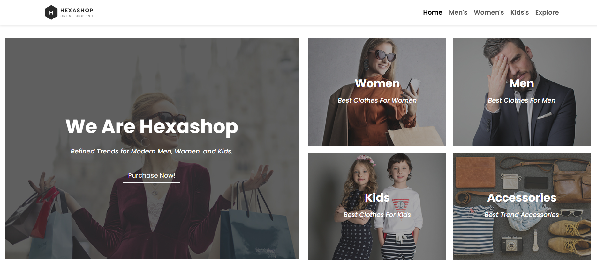

# 🛍️ HexaShop — Responsive E-Commerce Website

A stylish and responsive e-commerce website built using **HTML**, **CSS**, and **Bootstrap 5**.  
The project demonstrates modern web layout, reusable components, and responsive grid design.

---

## 🚀 Live Demo
🔗 **Live Site:** Coming Soon  
💻 **Source Code:** [View Repository](#)

---

## 🧩 Features
- Fully responsive using **Bootstrap grid system**
- Modern, minimal e-commerce layout
- Product cards with hover effects
- Organized sections **(Home, men, women, kids, explore, footer)**
- Clean and professional design — perfect for portfolio showcase

---

## 🛠️ Technologies Used
- **HTML5**
- **CSS3**
- **Bootstrap 5**

---

## 📸 Preview

---

## 📂 Folder Structure

Hexashop/
├─ index.html
├─ style.css
├─ images/
└─ README.md

---

## 👤 Author
**Mahir panchal**  
Frontend Developer | Full-Stack Web Development Learner  
[GitHub](https://github.com/mahir9104) | [LinkedIn](https://www.linkedin.com/in/mahir-panchal-052232331/)
